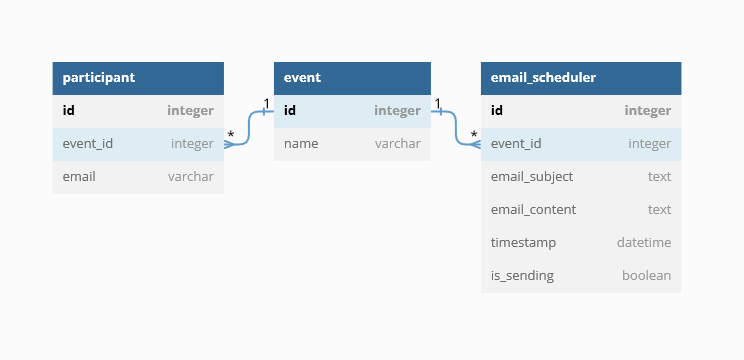

[](https://flask-migrate.readthedocs.io/en/latest/)

# API Flask Email Sender Example
example api for auto sending email from data timestamp, schedule will run every 1 minute  
you can see the scheduler function in worker/email_sender_worker.py and scheduler in app.py

## Installation  
`create .env from .env.example`  
modify env with your data  

```
pip install pipenv
pipenv shell
pipenv install
```
run this command for install pipenv and using virtual environment

```
flask db upgrade
```
run this command for migration the database

## Run code
```
flask run
```
run this command to run flask app  
the app will run in `127.0.0.1/5000`

## Postman collection
you can download the postman collection from the root dir or 
[Download here](EmailSender.postman_collection.json)

## Table Schema
